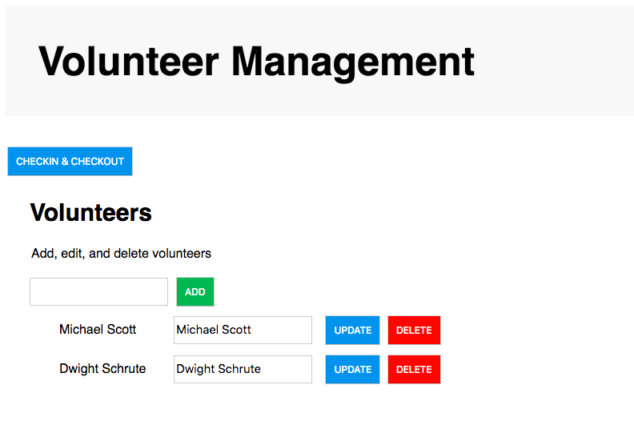

# Volunteer Checkin App

Simple CRUD web application to manage volunteers at an event. 

## Installation

### Requirements

* Python 2.7 
* Flask
* SQLAlchemy

```
$ pip install flask sqlalchemy flask-sqlalchemy
```

## Usage
### Initialize Database 
In python shell
```
>>> from bookmanager import db
>>> db.create_all()
>>> exit()
```

### Run App
Create virtual environment 
```
python app.py
```

## Project Status


### Features
* Add, update, and delete volunteers
* Check-in and check-out volunteers 

### Roadmap  
* Add check-in and check-out time stamps 
* Add events
* Add accounts with flask-login 

## Contributing
Pull request are welcome. 

## Acknowledgment 
* [Inspiration](https://www.codementor.io/garethdwyer/building-a-crud-application-with-flask-and-sqlalchemy-dm3wv7yu2)
